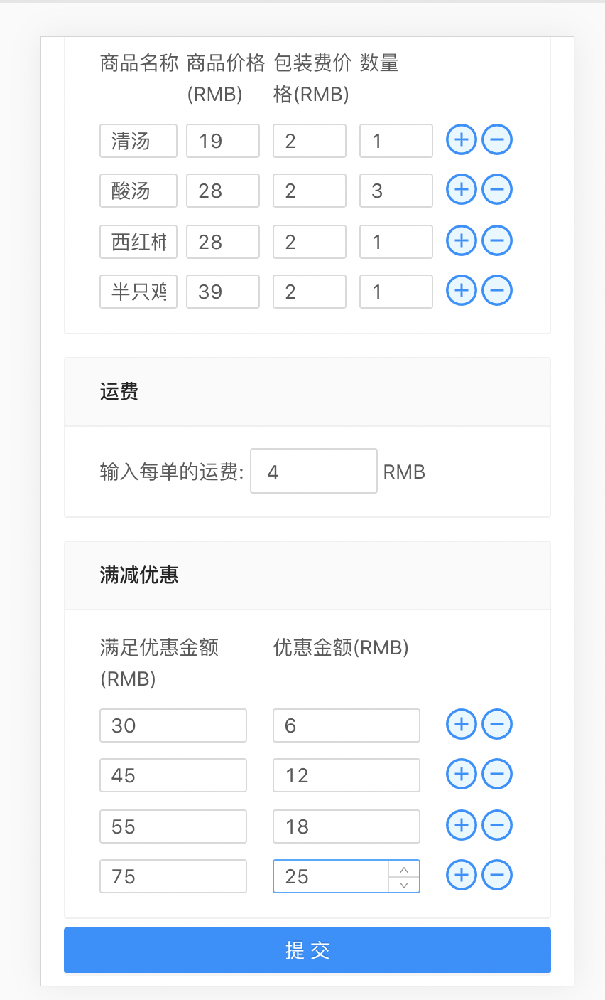
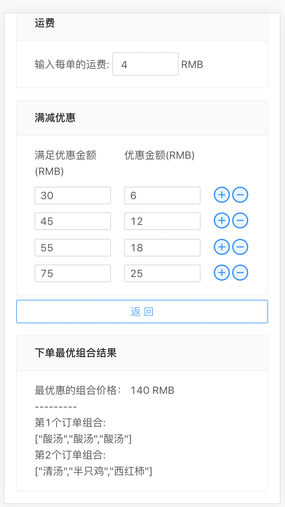

# 外卖最优惠下单组合指南

- n个产品分成m组问题算法 --> index.py
- python作为后端服务，通过http请求交互,yarn run server可以直接使用postman进行后端请求
- react+webpack+ts+antd
- 屏幕自适应

界面交互：

下单结果展示：

安装包：
yarn install
启动后端服务：
yarn run server 
启动前端服务：
yarn run start

待完成的工作：
- 优化编译速度
- 部署服务到github
